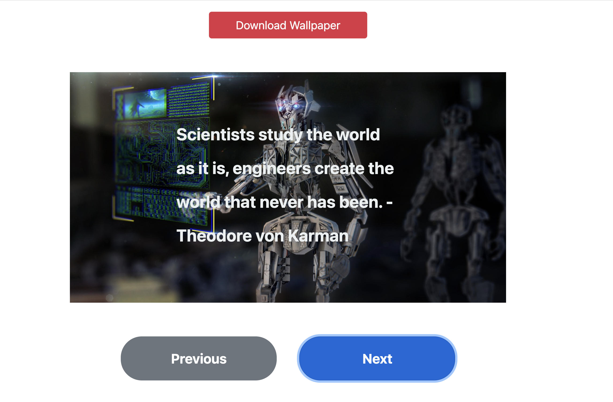

# Motivational Speech Wallpaper Generator 🎯

A dynamic web application that creates beautiful motivational wallpapers with inspirational quotes. Perfect for generating desktop backgrounds, social media posts, or simply getting your daily dose of motivation!

## 🚀 Demo
[Live Demo](https://nanachiki.github.io/Motivational-Speach-Wallpaper/)


1. **Antoine de Saint-Exupéry**: "Perfection is achieved, not when there is nothing more to add, but when there is nothing left to take away."
2. **Gordon Lindsay Glegg**: "The scientist discovers a new type of material or energy and the engineer discovers a new use for it."
3. **Theodore von Karman**: "Scientists study the world as it is, engineers create the world that never has been."

## 🌟 Features
- **Pre-loaded Motivational Quotes**: Browse through carefully curated motivational quotes from famous personalities
- **Custom Wallpaper Creation**: Add your own inspirational quotes with custom background images
- **Interactive Navigation**: Easily navigate between different wallpapers using Previous/Next buttons
- **Downloadable Wallpapers**: Download your favorite wallpapers as JPEG images
- **Responsive Design**: Works seamlessly on desktop and mobile devices
- **Customizable Text**: Choose your own text colors and positioning for maximum visual impact
- **Live Preview**: See your wallpaper creation in real-time before downloading

## 🛠️ Technologies Used

- **HTML**: Structure and layout
- **CSS**: Styling and responsive design
- **JavaScript (ES6+)**: Interactive functionality and wallpaper generation
- **Bootstrap 4.5**: UI components and responsive grid system
- **Canvas API**: Image processing and download functionality

## 📋 Prerequisites

- A modern web browser (Chrome, Firefox, Safari, Edge, etc.)
- Internet connection (for loading external images and Bootstrap CDN)

## 🎯 Getting Started

1. **Clone the repository**:
```bash
git clone https://github.com/NanaChiki/Motivational-Speach-Wallpaper.git
cd motivational-speech-wallpaper
```

2. **Open the application**:
Simply open `index.html` in your web browser, or use a local server:
```bash
# Using Python
python -m http.server 8000

# Using Node.js (if you have live-server installed)
live-server
```

3. **Start creating wallpapers**! 🎨

## 🖌️ How to use

### Browsing Pre-loaded Wallpapers
1. Use the **Previous** and **Next** buttons to navigate through existing wallpapers
2. Click the **Download** button to save the current wallpaper to your device

### Creating Custom Wallpapers
1. Scroll down to the "Submit a New Motivational Wallpaper" section
2. Fill in the form:
  - **Motivational Quote**: Enter your inspiring text
  - **Background Image URL**: Provide a link to your desired background image
  - **Text Color**: Enter a hex color code (e.g., FFFFFF for white, 000000 for black)
3. Click **Add a new wallpaper** to create and view your custom wallpaper
4. Your wallpaper will be automatically displayed and added to the navigation

## 🏗️ Project Structure
```
├── index.html # Main HTML structure
├── style.css # Custom styles
├── main.js # JavaScript functionality
├── images/
│   ├── demo.png
├── README.md # Project documentation
```

## 🔧 Technical Details

### Classes and Architecture

- **`Wallpaper`**: Core class that handles individual wallpaper creation
  - Properties: text, textColor, imageUrl, textPositionX, textPositionY
  - Methods: `createWallpaper()` - generates the complete wallpaper DOM structure

- **`WallpaperManager`**: Manages the collection of wallpapers
  - Methods: `showWallpaper(index)`, `randomTextPosition()`

### Key Features Implementation

- **Dynamic Text Positioning**: Text can be positioned at start, center, or end both horizontally and vertically
- **Cross-Origin Image Handling**: Proper handling of external images for download functionality
- **Responsive Design**: Uses Bootstrap's grid system and custom CSS for mobile-first design
- **Form Validation**: Built-in HTML5 validation for required fields

## 🎨 Customization

### Adding More Pre-loaded Wallpapers

Edit the `wallpapers` array in `main.js`:

```javascript
const wallpapers = [
    new Wallpaper(
        "Your motivational quote here",
        "textColorHex",  // without #
        "https://your-image-url.com/image.jpg",
        "textPositionY", // start, center, or end
        "textPositionX"  // start, center, or end
    ),
    // Add more wallpapers...
];
```

### Styling

Modify `style.css` to customize:
- Font sizes and families
- Color schemes
- Button styles
- Responsive breakpoints

## 🤝 Contributing

1. Fork the repository
2. Create a feature branch (`git checkout -b feature/AmazingFeature`)
3. Commit your changes (`git commit -m 'Add some AmazingFeature'`)
4. Push to the branch (`git push origin feature/AmazingFeature`)
5. Open a Pull Request

## 📝 Future Enhancements

- [ ] Font selection options
- [ ] Text shadow and outline effects
- [ ] Multiple text positioning on single wallpaper
- [ ] Local image upload functionality
- [ ] Wallpaper templates and presets
- [ ] Social media sharing integration
- [ ] Wallpaper collections and categories
- [ ] Dark/Light theme toggle

## 📄 License

This project is open source and available under the [MIT License](LICENSE).

## 🙏 Acknowledgments

- Bootstrap team for the excellent CSS framework
- Pixabay for providing free stock images used in the demo
- All the inspirational quote authors whose wisdom makes this project meaningful

---

Made with ❤️ for spreading motivation and positivity!